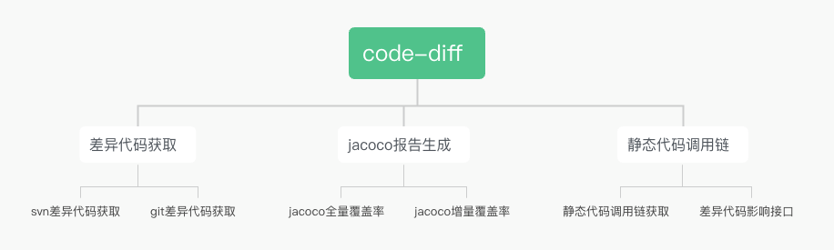
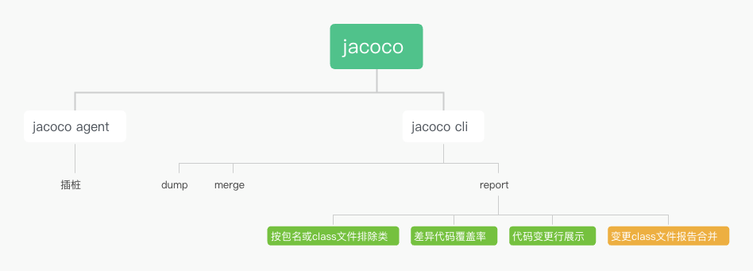
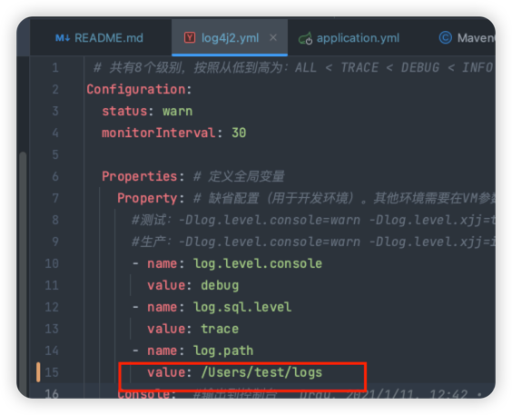

# code-diff
基于git或svn的差异代码获取


### 简介
+ 本项目主要是用于基于jacoco的增量代码统计，增量代码的统计核心问题是如何获得增量代码，网络上关于增量代码的获取相关资料比较少，而且代码注释也没有，阅读起来相对困难，我这边参考了几个项目后根据实际需求，进行了整理，请配合[jacoco二开](https://gitee.com/Dray/jacoco.git)一起使用

具体实现方案请参考[博客](https://blog.csdn.net/tushuping/article/details/112613528)
## 划重点本项目基于JDK1.8，直接使用master分支即可
### 功能介绍

如上图所示，code-diff最开始只是用于差异代码的获取，后来随着网友们的需求和扩展，目前已经支持以下功能：
* 支持基于git的差异方法获取
 > 1. 验证支持账号密码和秘钥
 > 2. git支持基于分支对比，基于commitId对比，以及基于tag对比
* 支持基于svn的差异方法获取
 > 1. svn支持基于同分支不同reversion，不同分支同一reversion，不同分支不同reversion
* 支持jacoco全量代码覆盖率报告生成
* 支持jacoco增量代码覆盖率报告生成
* 支持基于git的方法的静态调用链
* 支持基于git的变更代码影响接口（支持基于mybatis的sql变更影响的接口）
* 支持基于svn的静态调用链
* 支持基于svn的变更代码影响接口
* 影响接口支持http，dubbo以及自定义起始类，自定义起始方法的代码调用链

jacoco二开有部分代码开源，部分未开源，但是提供了jar包，在本工程的lib目录下（lib/org.jacoco.cli-0.8.7-SNAPSHOT-nodeps.jar）

如上图所示：
* jacoco-cli.jar：差异代码覆盖率（已开源）
* jacoco-cli.jar：按包名或class文件排除类（未开源）
* jacoco-cli.jar：代码变更行展示（未开源）
* jacoco-cli.jar：变更class文件覆盖率合并（未开源，未提供使用，可参考[博客](https://blog.csdn.net/tushuping/article/details/131640959?spm=1001.2014.3001.5501)）
### 使用方法
* 源码方式使用
    #### 1、修改application.yml

```agsl
        #基于git
        git:
          userName: admin
          password: 123456
          local:
            base:
              dir: D:\git-test
        git支持ssh（目前支持分支）配置
        git:
          ssh:
            priKey: C:\Users\mylocl/.ssh/id_rsa.
        ##基于svn
        svn:
          userName: admin
          password: 123456
          local:
            base:
              dir: D:\svn-test  
        maven:
          home: E:/Program Files/apache-maven-3.6.3 #maven的安装目录，此配置主要用于代码编译，用于静态代码分析功能，如果只差异分析，可以不配置
        root:
          code:
            path: src/main/java/ #代码的根目录，非标准maven项目需要自定义
        jacoco:
          root:
            path: H:/jacoco/root/ #jacoco报告的根目录      
```
     如果启动报日志错误，可以修改日志路径,当然也可以启动时修改jvm参数-Dlog.path=xxx


    #### 2、运行项目，访问http://127.0.0.1:8085/doc.html
* docker方式使用

1、拉取镜像(以amd64为例，如果是arm64请拉取arm64的镜像,地址为https://hub.docker.com/repository/docker/rayduan/code-diff/general)
```angular2html
docker pull rayduan/code-diff:v1.1-amd64
```
2、运行镜像
```angular2html
docker run -d -p 8085:8085  --name code-diff rayduan/code-diff:v1.1-amd64
```
就是这么简单什么也不用配置，当然如果maven有私服，只用修改~/.m2/settings.xml即可

## 使用示例    


	 2.1 输入git地址，填写差异分支的旧版本，新版本，执行，就可以获取差异信息

## 其他
在linux系统部署时请注意修改代码的基础路径和日志路径，如：
```angular2html
java -jar  -Dlog.path=/app/data2/devops/code-diff/logs  -Dgit.local.base.dir=/app/data2/devops/code-diff/   application-1.0.0-SNAPSHOT.jar
```


如有疑问，请加群主入群


##问题点：
如果ssh方式出现
invalid privatekey: [B@6553d80f 则是ssh的版本太高，通过指定旧版本的方式重新生成即可
```
ssh-keygen -m PEM -t rsa
```
---
[add]
### 新增：
* 1.支持差异对比mapper xml获取变更的mapper类中的方法
* 2.支持获取项目的静态调用链
* 3.支持通过差异代码和静态调用链推导变更http接口和dubbo接口
### 修复：
* 1.方法中的注释 // 应该不做代码差异
* 2.缺失构造方法的diff
* 3.根据包名对调用链进行降噪
#### 注意，因为需要编译代码，所以要配置maven，另外本项目运行和编译的代码均采用jdk1.8
```agsl
maven:
  home: /usr/local/app/apache-maven-3.8.3
```
---
【add】
### 修复：
* 1.修复循环引用问题
* 2.优化lambda表达式调用链问题

【modify】 2023-04-05
### 变更：
1. 为了降低使用门槛合并代码结构为单模块
2. 增加了dockerfile，在工程目录下只需执行以下命令就可以构建镜像
    ```
   mvn clean package -Dmaven.test.skip=true
   docker build -t code-diff .
   ```
   当然我已经构建了一个通用[镜像](https://hub.docker.com/layers/rayduan/code-diff/v1/images/sha256-eefb21263cef421866ff68b193b4311a877e29e20a5acb2ef5745de1aefd396f?context=repo)
   获取镜像后只需运行

   ``` 
   
    docker run -d -p 8085:8085  --restart=always -e JAVA_OPTS="-Xms512m -Xmx1g  -Dspring.profiles.active=docker"   --name code-diff rayduan/code-diff:v1
   
   ```

  镜像中内置了git和maven，maven settings使用了阿里云镜像，如果需要私服可以手动修改镜像内的文件，或者重新自己构建镜像，另外私钥地址可以运行时指定卷映射出去(-v root/.ssh/id_rsa:root/.ssh/id_rsa)，然后通过jvm参数指定，具体涉及到docker相关姿势请手动上网，一般情况下运行上述命令即可，无需做任何改动
  运行时参数可以通过修改JAVA_OPTS指定，如git的账号密码：
  ```
     JAVA_OPTS="-Dgit.userName=zs -Dgit.password=123456 -Dgit.ssh.priKey=/root/.ssh/id_rsa" 
  ```

【modify】2023-04-16
支持jacoco报告生成，操作步骤参考[这里](https://gitee.com/Dray/code-diff/wikis/%E4%BD%BF%E7%94%A8jacoco%E5%91%BD%E4%BB%A4%E7%94%9F%E6%88%90jacoco%E6%8A%A5%E5%91%8A?sort_id=8001440)